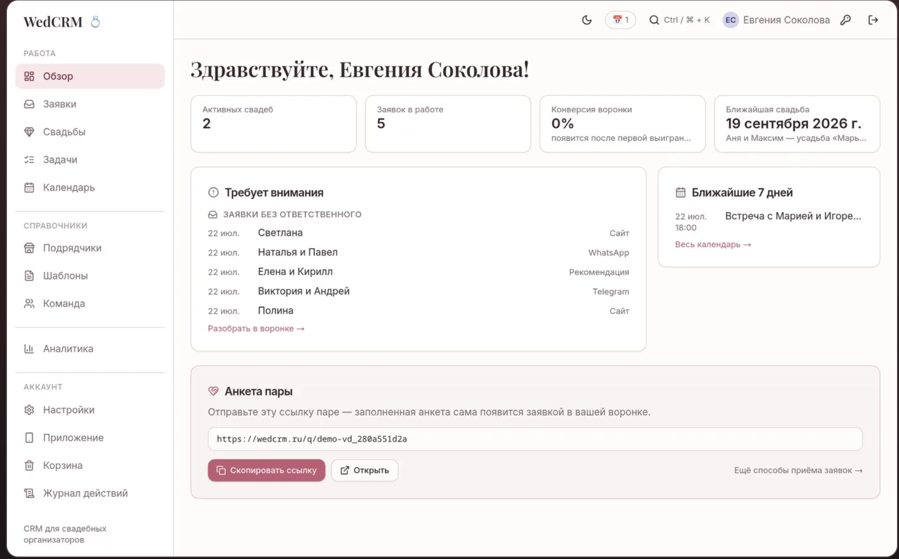
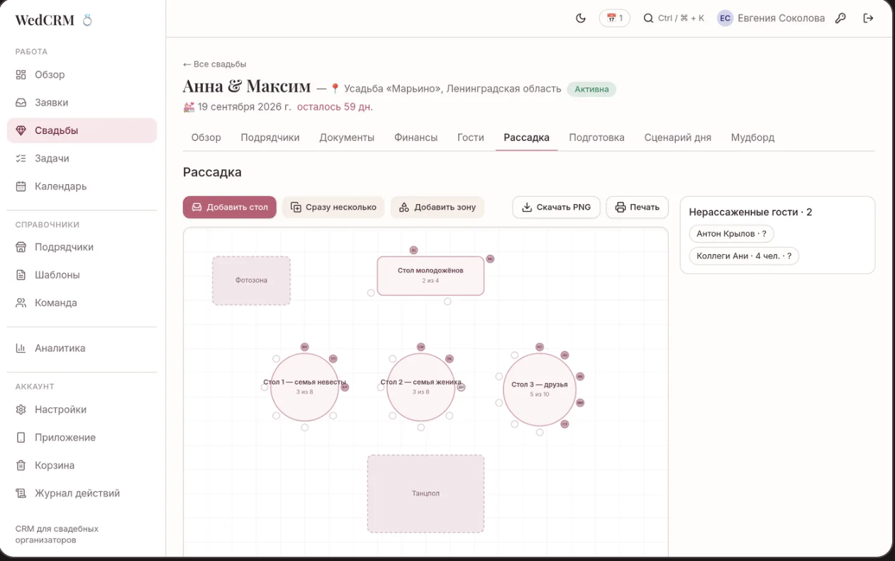
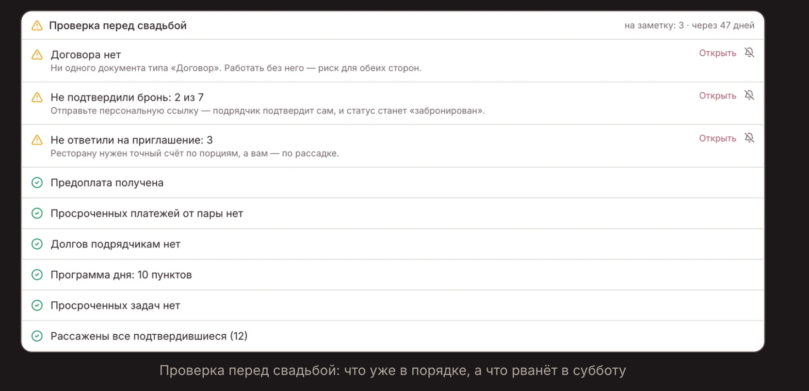

# tie.event v2 — дизайн экранов и расположение элементов
**Статус:** принятая спецификация для следующей итерации.
**Назначение:** рабочее пространство агентства, пары и
приглашённых участников; публичная часть представляет
агентство и свадьбу, но не раскрывает данные проекта.
**Граница:** внешний вид, расположение, состояния и тексты
интерфейса. Схема данных, серверные правила и маршруты
определяются в [REQUIREMENTS.md](REQUIREMENTS.md) и `TECHNICAL.md`.
## 1. Основание и границы референсов
### Изученная текущая основа
- `src/styles.css`: светлая оболочка, тонкие линии, белые карточки, видимый фокус, serif для крупных заголовков.
- `src/ui/AppShell.jsx`: отдельные навигации агентства и проекта, переключатель свадьбы.
- `src/main.jsx`: публичная часть, обзор, финансы, каталог, гибкие таблицы, файлы и история.
- `src/ui/ProjectTools.jsx`: приглашения, выплаты, конфликты, редактирование структуры.
Существующие работающие области сохраняются. Пара продолжает
полностью менять содержимое и структуру своей свадьбы; новый
дизайн не превращает её кабинет в витрину или форму
согласования.
### Главный визуальный референс: WedCRM
В папке проекта сохранены исходные изображения. Они
используются для понимания плотности, иерархии и поведения, без
копирования логотипов, текста, фотографий или фирменного
интерфейса.
| Референс | Что видно | Что переносим в tie.event |
| --- | --- | --- |
|  | постоянное левое меню, тонкий верхний бар, ряд KPI, широкий блок внимания и компактный блок ближайших событий | фиксированную рабочую рамку 240 px + 64 px, 4 ясных KPI, пропорцию обзора 2/3 и 1/3 |
|  | вкладки свадьбы, toolbar, спокойный холст с сеткой, круговые/прямоугольные столы, малые круги стульев, пунктирные зоны и нерассаженные гости | редактируемый двумерный план tie.event, где места всегда связаны с теми же строками гостей |
|  | короткий список проверок, различимые предупреждения и успехи, действие справа | отдельную компактную «Проверку перед свадьбой» с явным состоянием каждой проверки |
### Другие источники сценариев
- [Marryo](https://marryo.ru/), [That’s The One](https://www.thatstheone.com/), [Wedding Planning](https://planning.wedding/ru) и [Aisle Planner Client Portal](https://aisleplanner.com/products/client-portal/) — источники для исследовательской фазы публичного сайта, клиентского кабинета, гостей и планирования.
- Ниже описан предлагаемый дизайн tie.event, а не утверждения о текущем дизайне этих сервисов.
## 2. Визуальная система tie.event
### Характер
Интерфейс должен ощущаться как аккуратная рабочая папка
организатора: тёплый белый фон, спокойные карточки, строгие
данные и один выразительный акцент — припылённая роза.
Свадебность создают имена, даты, реальные изображения и
serif-заголовки, а не декоративные цветы, блёстки или стоковые
коллажи.
Знак `tie` с двумя кольцами сохраняется. Он стоит слева в sidebar и на
публичном сайте; в интерфейсе не используется как повторяющийся
орнамент.
### Цветовые токены
| Токен | HEX | Применение |
| --- | --- | --- |
| `--canvas` | `#FDFCFC` | общий тёплый белый фон, topbar и sidebar |
| `--surface` | `#FFFFFF` | карточки, модальные окна, поля и холст рассадки |
| `--border` | `#E5DFE2` | контуры, разделители, неактивная сетка |
| `--rose` | `#AD4E6C` | основная CTA, активная вкладка, ссылки и focus ring |
| `--rose-pale` | `#F8E8EE` | активный пункт меню, мягкие панели, выбранный объект |
| `--ink` | `#302B2E` | заголовки, основной текст, пиктограммы |
Семантика: успех `#168B64`, предупреждение `#BE7B19`, ошибка `#B74758`,
неизвестно `#767077`, не применимо `#8A8588`. Семантический цвет всегда
сопровождается текстом, иконкой и названием статуса.
### Типографика и ритм
- Заголовки, имена пар, названия разделов: `Georgia, Times New Roman, serif`, вес 500, трекинг `-0.04em`; h1 40–48 px desktop и 32–36 px mobile.
- Основной текст, формы, таблицы: системный sans-serif 14–16 px, line-height 1.45–1.6.
- Дата, служебная подпись, заголовок колонок: системный sans-serif 12 px; не использовать декоративный monospace как обязательный стиль.
- Базовый шаг 4 px. Основные интервалы: 8, 12, 16, 20, 24, 32, 48 px.
- Карточки: белый `--surface`, border `--border` 1 px, radius 12–14 px, padding 20–24 px. Тень только при открытом меню/модальном окне.
- Главная кнопка: `--rose`, белый текст, radius 10 px, высота 40 px; вторичная — белая с границей; опасное действие явно красное.
### Поведение на ширинах
| Ширина | Компоновка |
| --- | --- |
| 1280 px+ | sidebar 240 px, topbar 64 px, контент до 1440 px, обзор 2/3 + 1/3 |
| 768–1279 px | sidebar сворачивается в 72 px с tooltip, вкладки свадьбы горизонтально прокручиваются |
| 480–767 px | sidebar заменяет меню из topbar; контент одной колонкой, карточки без горизонтального скролла |
| 320–479 px | действия во всю ширину, таблицы с прокруткой и закреплённой первой колонкой, нижняя навигация |
## 3. Общая оболочка и навигация
### Desktop: организатор
Sidebar постоянный, 240 px, фон `--canvas`, правая граница `--border`. Сверху: `tie`,
затем логические группы. Между группами — тонкий divider и подпись
11–12 px. Активный пункт: `--rose-pale`, текст `--rose`, иконка слева; hover без
резкого фона.
```
┌──────────────────────┬─────────────────────────────────────────────────────┐
│ tie                  │ поиск · уведомления · профиль                         │
│                      ├─────────────────────────────────────────────────────┤
│ РАБОТА               │                                                     │
│ Сегодня              │                    Содержимое                        │
│ Заявки               │                                                     │
│ Свадьбы              │                                                     │
│ Задачи               │                                                     │
│ Календарь            │                                                     │
│ ───────────────────  │                                                     │
│ СПРАВОЧНИКИ          │                                                     │
│ Подрядчики           │                                                     │
│ Шаблоны              │                                                     │
│ Команда              │                                                     │
│ ───────────────────  │                                                     │
│ УПРАВЛЕНИЕ           │                                                     │
│ Финансы агентства    │                                                     │
│ Публичный сайт       │                                                     │
│ Настройки            │                                                     │
└──────────────────────┴─────────────────────────────────────────────────────┘
```
Topbar постоянный, 64 px: слева на tablet — название текущего места;
справа — поиск, центр уведомлений, аватар/профиль. Счётчик
уведомлений показывает только доступные пользователю записи.
### Desktop: внутри свадьбы
В sidebar организатора над группой «Работа» появляется
переключатель свадьбы. Контент получает шапку проекта: «Алина и
Максим», дата, место, статус, дней до свадьбы и действие
«Настройки свадьбы». Под шапкой — горизонтальные tabs, не
дублирующие sidebar.
```
┌───────────────────────────────────────────────────────────────────────────┐
│ Алина и Максим · 14 сентября 2027 · Усадьба «Роща» · осталось 84 дня  [⋯]│
├───────────────────────────────────────────────────────────────────────────┤
│ Обзор | План | Согласования | Подрядчики | Финансы | Гости | Рассадка | ...│
├───────────────────────────────────────────────────────────────────────────┤
│                                                                           │
│                              Содержимое вкладки                           │
│                                                                           │
└───────────────────────────────────────────────────────────────────────────┘
```
Порядок tabs строго: «Обзор», «План», «Согласования»,
«Подрядчики», «Финансы», «Гости», «Рассадка», «День свадьбы»,
«Ещё».
- «Финансы» раскрывает «Смета» и «Выплаты».
- «День свадьбы» раскрывает тайминг пары и тайминг команды.
- «Ещё» содержит: «Сайт свадьбы», «Все таблицы», «Файлы», «История», «Участники и офлайн», «Настройки проекта».
- Tabs доступны по клавиатуре: стрелки меняют активную вкладку, `Enter`/`Space` открывает; выбранная помечена `aria-selected`.
### Пара и мобильный интерфейс
У пары sidebar показывает только её свадьбу и доступные действия
внутри неё. Агентские разделы, список чужих проектов и их
счётчики не выводятся. При действующем полном назначении `couple`
проектный доступ пары сохраняется: «План», «Согласования», «Гости», «Рассадка»,
«Финансы», «Все таблицы» и «Настройки проекта» не урезаются до
просмотра. Если администратор явно ограничил назначение, вкладки,
действия и поля следуют текущим правам; отзыв применяется без повторного входа.
На mobile topbar показывает название проекта, уведомления и меню.
Внизу закреплены четыре перехода: «Обзор», «План»,
«Согласования», «Ещё». «Ещё» открывает sheet со всеми tabs, включая
Гостей, Рассадку, Финансы и День свадьбы. Гостевой сайт не
показывает эту оболочку.
## 4. Обзор агентства «Сегодня»
### Компоновка
```
┌───────────────────────────────────────────────────────────────────────────┐
│ Здравствуйте, Евгения                                                    │
├───────────────┬──────────────────┬───────────────────┬────────────────────┤
│ Активные      │ На рассмотрении  │ Просрочено задач  │ Ближайшая свадьба  │
│ свадьбы  12   │ заявок  5        │ 3                 │ 14 сен · Алина&М.  │
├───────────────────────────────────────────────┬───────────────────────────┤
│ ТРЕБУЕТ ВНИМАНИЯ                              │ БЛИЖАЙШИЕ 7 ДНЕЙ           │
│ задача · название · срок · ответственный  [→] │ дата / время · событие     │
│ платёж · название · срок · проект         [→] │ [Открыть календарь]        │
│ RSVP · без ответа · проект                 [→] │                           │
├───────────────────────────────────────────────┴───────────────────────────┤
│ План на сегодня / быстрые действия                                      │
└───────────────────────────────────────────────────────────────────────────┘
```
Четыре KPI обязательны: «Активные свадьбы», «Заявки на
рассмотрении», «Задачи просрочены», «Ближайшая свадьба».
Конверсию не показывать: в продукте нет согласованной
sales-модели. Каждая KPI-карточка кликабельна только при наличии
доступного фильтра и прав.
Основная область разделена 2/3 слева и 1/3 справа. Слева — максимум
восемь карточек «Требует внимания» в порядке: просроченное и
конфликты, действие сегодня, ближайшие сроки. Каждая строка
содержит тип, название, дату/время, ответственного и ссылку на
конкретный объект. Справа — события на 7 дней. Ниже —
персональный список «Сегодня».
Организатор видит только разрешённые проекты. Пара вместо
«Сегодня» получает «Обзор» своей свадьбы. Нельзя показывать
количество недоступных заявок, проектов или задач.
## 5. Обзор свадьбы и «Проверка перед свадьбой»
### Экран
Верхний ряд: название, дата, место, число дней до даты; после даты
написать «Свадьба прошла N дней назад», без отрицательного
счётчика. Ниже: блок «Требует внимания» слева, «Ближайшие 7 дней»
справа, затем согласования, RSVP и финансовая краткая сводка.
```
┌───────────────────────────────────────────────────────────────────────────┐
│ АЛИНА И МАКСИМ · 14 сентября · осталось 84 дня                            │
├───────────────────────────────────────────────┬───────────────────────────┤
│ ТРЕБУЕТ ВНИМАНИЯ                              │ БЛИЖАЙШИЕ 7 ДНЕЙ           │
│ [!] Утвердить меню · −60 · Алина      [Открыть]│ 22 июл · встреча          │
│ [!] 2 гостя без ответа · до 16 июля   [Открыть]│ 25 июл · выплата          │
├───────────────────────────────────────────────┴───────────────────────────┤
│ ПРОВЕРКА ПЕРЕД СВАДЬБОЙ                                    на заметку: 3 │
│ [!] RSVP: 2 гостя без ответа                         [Открыть] [Скрыть] │
│ [✓] Все подтверждённые гости рассажены                              │
│ [?] Проверка договоров пока недоступна                              │
│ [—] Проверка трансфера не применяется к этой свадьбе                │
└───────────────────────────────────────────────────────────────────────────┘
```
«Проверка перед свадьбой» компактна: список строк с границей,
иконкой статуса, названием, пояснением при проблеме и «Открыть».
Справа допускается «Скрыть из списка»; это только mute, не успех и
не закрытие проблемы.
Состояния проверки: `pass` — правило проверено и проблем нет;
`warning` — есть проблема; `unknown` — данных/проверки пока нет; `not_applicable`
— правило отключено для свадьбы. Не объединять `unknown`, mute и
`not_applicable` с успехом. Заголовок показывает «на заметку: N» как
сумму предупреждений; отдельный счётчик невыполнимых проверок
не скрывает их.
Источники всех проверок определены в REQUIREMENTS.md §3.3:
задачи, выплаты, решения, RSVP, рассадка, пересечения, ручная проверка
проектного договора и подтверждение брони выбранных услуг.
Договор требует типа файла и отметки проверившего; бронь — отдельного
статуса и основания подтверждения. При отсутствии нужных данных
выводится `unknown`; наличие файла или согласованного варианта само
по себе не даёт зелёного статуса.
Показатель плана: «Выполнено задач 12 из 20». Формула использует
`done / (todo + doing + done)`; `skipped` не увеличивает выполненное и не входит в
знаменатель. При отсутствии активных задач — «План не
заполнен».
## 6. План подготовки
### Список, доска и календарь
```
┌───────────────────────────────────────────────────────────────────────────┐
│ ПЛАН  [Список] [Доска] [Календарь]  [Мои ▾] [Все статусы ▾] [+ Задача]   │
├──────────┬──────────────────────────┬────────────┬───────────┬───────────┤
│ −60 дней │ Утвердить план рассадки  │ Алина      │ В работе  │ 16 июля   │
│ −45 дней │ Подтвердить трансфер     │ Катя       │ План      │ 31 июля   │
│ −30 дней │ Передать тайминг         │ Команда    │ Выполнено │ 15 августа│
└──────────┴──────────────────────────┴────────────┴───────────┴───────────┘
```
Задача — нативный объект, не строка произвольной таблицы. Поля:
название, описание, этап, статус, основной ответственный,
участники, приоритет, зависимости, правило срока,
точная/вычисленная дата, связанные согласования, подрядчики,
файлы, комментарии, порядок, автор и дата выполнения.
Статусы называются и хранятся так: «Запланировано» `todo`, «В
работе» `doing`, «Выполнено» `done`, «Не требуется» `skipped`. «Просрочено»
и «Заблокировано» — вычисляемые признаки. Для `skipped` обязательна
короткая причина. Возврат из `done`/`skipped` пишет запись в историю.
Срок: `relative` — за N дней до даты свадьбы с видимой вычисленной
датой; `fixed` — конкретная дата, не меняющаяся при переносе
свадьбы. При переносе система показывает изменения
относительных сроков до сохранения; фиксированные не меняет
молча.
Фильтры «Мои» и «Все» являются явными значениями, а не неясным
toggle: «Мои» показывает задачи, где пользователь основной
ответственный или участник; «Все» — все разрешённые задачи
проекта. Пара всегда может перейти из «Мои» в «Все» и
редактировать доступные задачи.
Карточка/строка действия: отметить `done`, открыть панель,
изменить срок/ответственных, перевести в «Не требуется» с причиной. Новые действия
не работают офлайн: при отсутствии сети они отключены с текстом
«Для создания и изменения задач подключитесь к сети»;
существующая офлайн-подготовка остаётся отдельной функцией.
## 7. Согласования и версии вариантов
```
┌───────────────────────────────────────────────────────────────────────────┐
│ СОГЛАСОВАНИЯ  Декор церемонии · версия 3 · до −45 дней [+ Вариант]        │
├──────────────────────┬──────────────────────┬─────────────────────────────┤
│ «Сад»                │ «Свечи»              │ ИСТОРИЯ                     │
│ фото / файлы         │ фото / файлы          │ v1 · 12.06 · Катя           │
│ 180 000 ₽            │ 205 000 ₽            │ v2 · правки пары            │
│ [Выбрать]            │ [Выбрать]            │ v3 · ждёт ответа            │
└──────────────────────┴──────────────────────┴─────────────────────────────┘
```
Согласование содержит название, категорию, дедлайн,
ответственного, согласующих, связь с подрядчиком/статьёй сметы
и итоговый статус. Вариант содержит описание, точную цену или
«Цена не согласована», файлы, ссылки, плюсы, ограничения и
комментарии.
Кнопки имеют стабильные названия: «Сохранить черновик»,
«Отправить на согласование», «Выбрать вариант», «Нужны
изменения», «Отозвать согласование». Последнее действие доступно
автору/уполномоченному редактору, требует причины и вызывает
`approval.withdraw`; голоса остаются историей, смета не меняется.
Отправленная ревизия
неизменяема; правка создаёт следующую версию с причиной. Итог
фиксирует пользователя, время, вариант, версию и комментарий.
Перед отправкой автор явно выбирает правило: «Достаточно одного
решения» (`any`) или «Нужны решения всех» (`all`) и видит имена
согласующих. При `any` первое допустимое итоговое решение закрывает
ревизию. При `all` все выбранные участники должны утвердить один
вариант; разные варианты дают «Нужно обсудить», а запрос правок хотя
бы от одного — «Нужны изменения».
Пара и организатор создают варианты и версии в своём проекте.
Read-only пользователь видит подсказку о причине и владельце
доступа, а не ложную активную кнопку. При отсутствии сети все
новые действия согласования отключены; черновик не имитирует
сохранение.
## 8. Гости, сайт свадьбы и персональный RSVP
### Рабочий список гостей
Начальные связанные поля: имя, группа, приглашение, RSVP,
питание, ограничения, контакт, дети, трансфер,
стол, комментарий. Они редактируемы в структуре проекта;
удаление поля показывает, что будет затронуто в RSVP и рассадке.
Две отдельные колонки/фильтра: «Приглашение» (не создано,
ссылка выдана, отозвано, истекло) и «Ответ» (нет ответа,
придёт, не придёт, пока не знает). Не считать выдачу ссылки ответом.
В шапке: `подтвердили / всего`, `без ответа`. Фильтры: группа,
приглашение, ответ, стол, питание, трансфер. Одна строка — один
человек, семейная ссылка объединяет несколько конкретных строк.
Массовые действия: создать приглашения, назначить группу,
экспортировать вид, добавить к столу. Ссылки копируются только
сразу после создания/перевыпуска; при повторном входе raw token
не восстанавливается из БД. Автоматическая рассылка не предполагается.
### Публичная страница свадьбы
```
┌──────────────────────────────────────────┐
│             Алина & Максим                │
│ 14 сентября 2027 · Усадьба «Роща»        │
│                                          │
│ Вы приглашены разделить этот день.        │
│ [Подтвердить участие] [Не смогу прийти]   │
│ Нина [Приду ▾] · Артём [Пока не знаю ▾]  │
│ Питание и ограничения [_______________]   │
│ [Отправить ответ]                         │
│ Программа · Как добраться · Контакты      │
└──────────────────────────────────────────┘
```
Сайт свадьбы публикуется явно. Он получает отдельный `shareId`,
исключается из индексации и не показывает кабинет. Персональный
RSVP открывается только по непредсказуемой ссылке приглашения и
меняет лишь разрешённую гостевую строку/группу. После ответа:
«Ответ сохранён» и, если это разрешено, «Изменить ответ» до
дедлайна.
Настраиваемые публичные блоки: имена пары, дата/место, дресс-код,
программа, как добраться, контакты, питание и трансфер.
Спутник показан только при заранее выделенной placeholder-строке;
произвольных дополнительных вопросов/гостей в v2 нет. Публичные материалы имеют
статусы черновика и публикации. Старую или отозванную ссылку
сопровождать нейтральным сообщением и контактом организатора,
не данными другого гостя.
## 9. Рассадка
### Холст и список гостей
```
┌───────────────────────────────────────────────────────────────────────────┐
│ РАССАДКА [Добавить стол] [Несколько] [Добавить зону] [Сетка] [Печать]     │
├───────────────────────────────────────────────┬───────────────────────────┤
│                                               │ НЕРАССАЖЕННЫЕ · 2          │
│    ┌──── ФОТОЗОНА ────┐                      │ Антон Крылов   Нет ответа     │
│    └──────────────────┘                      │ Коллеги Ани · 4  Пока не знают  │
│                                               │                           │
│      ○ ○   ┌─────────┐   ○ ○                  │ СВОЙСТВА СТОЛА 2          │
│           ○│ СТОЛ 1  │○                      │ Название [семья жениха]   │
│      ○ ○   └─────────┘   ○ ○                  │ Форма [круглый ▾]         │
│                                               │ Мест [8] Поворот [0°]     │
│       ○ ○ ○  СТОЛ 2  ○ ○ ○                    │ [Удалить стол]             │
│                                               │                           │
│              ┌─ ТАНЦПОЛ ─┐                    │                           │
│              └───────────┘                    │                           │
└───────────────────────────────────────────────┴───────────────────────────┘
```
Toolbar расположен над холстом: «Добавить стол», «Сразу несколько»,
«Добавить зону», показ/скрытие сетки, «Скачать PNG», «Печать».
Прямое действие «Авторассадка» не показывать, пока правила
автоматического распределения не определены.
Холст белый, с очень светлой сеткой `--border`; зоны имеют `--rose-pale` и
dashed border. Столы создаются круглыми или прямоугольными, с
названием и счётчиком `3 из 8`; вокруг — небольшие круглые места.
Столы/зоны можно двигать, поворачивать и менять размер в
пределах холста.
Справа постоянно находятся нерассаженные гости и свойства
выделенного стола. На меньшей ширине это tabbed drawer. Гости —
реальные строки реестра, не копии имён. Перенос на место создаёт
связь с гостем; изменение RSVP/имени/ограничений отражается сразу.
«Не будет» (`declined`) посадить нельзя. «Нет ответа» (`unanswered`)
и «Пока не знает» (`tentative`) имеют разные подписи; tentative можно
посадить в черновой схеме с пометкой «Не подтвердил».
Проверки: переполнение, нерассаженные «Будет», двойная посадка,
«Не будет» на месте, пустое место, ограничения питания/детей.
Нажатие на проблему фокусирует стол и строку. Доступна
клавиатура: выбрать гостя, «Переместить», выбрать стол/место,
подтвердить.
## 10. Календарь и напоминания
Календарь агентства собирает задачи, выплаты, встречи, тайминги
и даты свадеб. Виды: «Месяц», «Неделя», «Повестка». Фильтры:
проект, сотрудник, тип, период, «Мои»/«Все», проблемы. Цвет
отмечает тип записи; проект назван текстом и не кодируется
цветом.
Создание в календаре предлагает «Задача» или «Встреча». Форма
встречи: название, начало/окончание, связанная свадьба,
ответственные, описание и место. Сроки задач/платежей открывают
редактор исходной записи. Произвольного конструктора напоминаний
у встречи нет: применяются фиксированные правила ТЗ и настройки
каналов/времени date-only сообщений в профиле.
Часовой пояс показывается для встреч. Внутренний центр
уведомлений обязателен; email показывается только если доставка
настроена.
Уведомление открывает объект и отмечается прочитанным.
Личное «Напомнить позже» есть у проверки готовности и не скрывает
источник из календаря. Новые
события и напоминания не создаются офлайн; кнопка объясняет
необходимость сети.
## 11. Подрядчики и финансы
«Подрядчики» — tab с каталогом выбранных для свадьбы услуг,
договорённостями, задачами и связанными согласованиями. Сумма в
варианте и смете связана, но цена может быть «не согласована»; не
подменять неизвестность нулём.
«Финансы» открывает два подтаба: «Смета» и «Выплаты». В обзоре и
Finance сохраняются разные показатели: согласованная стоимость,
оплачено, к оплате, средства пары у организаторов, остаток до
лимита. Карточка не смешивает бюджет свадьбы с собственными
деньгами агентства.
Выплата/движение открывается в панели или диалоге с конкретной
суммой, получателем, статьёй, датой, ответственным и
подтверждением. Для read-only — ясная подпись, для ошибки — полевая
ошибка, для конфликта — «ваше изменение / актуальное» с автором
и временем.
## 12. Публичный сайт агентства
Публичная часть использует те же `--canvas`, `--surface`, `--border`, `--rose`,
`--rose-pale`, `--ink`. Шапка: знак tie, «Подход», «Кейсы», «Пакеты», «FAQ»,
«Контакты», CTA «Оставить заявку». На mobile пункты доступны в меню;
CTA остаётся видимой.
Hero: serif-заголовок, понятный подзаголовок, CTA и один реальный
лицензированный кадр свадьбы или подготовки. Не использовать
чужие логотипы, стоковые коллажи и визуальную композицию
референсов.
Кейс: фото, название/имена с согласием, город/площадка, сезон, 2–3
тега, задача, решения, команда, галерея и CTA. Это отдельная
публикация, не приватный проект. В редакторе: «Черновик»,
«Опубликован», «Снят с публикации».
Пакет: название, кому подходит, что входит, границы
ответственности, формат, цена «от» или «по запросу», CTA «Обсудить
формат». Сравнение — таблица desktop и раскрывающиеся блоки mobile.
Пакеты редактируются агентством.
FAQ — аккордеон с доступным `aria-expanded`; одновременно открыт один
вопрос. Заявка: имя, дата, город/площадка, контакт, гости/бюджет
опционально, текст. После отправки показывать настроенное
агентством ожидание ответа. Одобрение связывается с созданием
проекта без дублей.
## 13. Состояния интерфейса
| Состояние | Поведение и текст |
| --- | --- |
| Загрузка | skeleton в геометрии блока; не прыгать разметкой и не показывать пустой успех |
| Пусто | белая карточка с тонкой пунктирной границей, объяснением и одной CTA «Добавить первую задачу» |
| Ошибка | текст о том, что не загрузилось, «Повторить», сохранение локально введённого текста формы |
| Нет доступа | «Этот раздел недоступен», причина области прав и переход к обзору разрешённой свадьбы |
| Только просмотр | заметная подпись в шапке; действия не исчезают бесследно, а объясняют причину |
| Сохранение | «Сохраняем…», защита от двойного запуска, данные остаются видимы |
| Сохранено | toast «Изменения сохранены»; для значимых правок — ссылка на историю |
| Нет сети | новые действия v2 отключены и объясняют требование сети; не обещать офлайн-очередь |
| Конфликт | сравнение «ваше изменение / актуальное», выбор по полям, автор и время версии |
| Удаление | диалог с названием и связанными объектами, «Отменить» / «Удалить», запись для восстановления в истории |
Ошибки располагаются под полем и привязаны через `aria-describedby`.
Формулировка конкретна: «Укажите дату», «Выберите хотя бы
одного согласующего», «Нельзя посадить гостя дважды».
## 14. Доступность и интеракции
- Контраст соответствует WCAG AA; `--rose` на белом проверяется отдельно для мелкого текста.
- Каждый интерактивный элемент имеет видимый focus ring 3 px в оттенке `--rose`; область касания минимум 44×44 px на touch-экране.
- Диалог удерживает фокус, закрывается `Escape`, возвращает фокус на вызвавший элемент. Удаление не является default submit.
- Иконки без текста имеют `aria-label`; декоративные изображения скрыты от скринридера, содержательные фото имеют alt с фактом, не оценкой.
- Рассадка доступна без drag-and-drop, tabs доступны клавиатурой, таблицы имеют `th`/заголовки и видимое состояние фильтра.
- `prefers-reduced-motion` отключает сдвиги, плавные раскрытия и декоративные анимации без потери смысла.
- RSVP на телефоне: label над полем, короткая последовательность, автозаполнение, без hover-обязательности и без требования учётной записи.
## 15. Очерёдность экранов
1. Оболочка, агентский «Сегодня», проектные tabs, обзор и проверка готовности.
2. Нативный План с задачами, сроками и календарём/уведомлениями.
3. Согласования, гости, публикация сайта свадьбы с персональным RSVP.
4. Рассадка, затем публичный сайт агентства, кейсы, пакеты и FAQ.
На каждом шаге сохраняются гибкие таблицы, история, действующие
финансы, роли и полный доступ пары к своей свадьбе.
