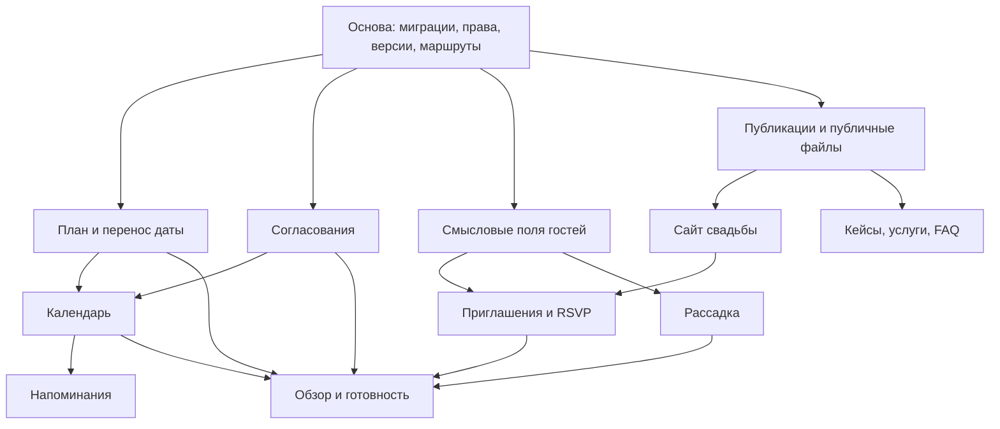

# tie.event — требования к развитию продукта v2

Дата: 8 сентября 2026. Аудитория: программист, дизайнер интерфейса и тестировщик.

Статус: задание на реализацию. Документ описывает целевое поведение, а не уже выпущенные функции. Основание — согласованные владельцем шесть дополнений к рабочему кабинету и развитие публичного сайта. Реализация ведётся в существующем проекте `tie.event`.

Связанные документы: [дизайн и расположение экранов](DESIGN.md), [технические решения и зависимости](TECHNICAL.md), [визуальный макет](prototype.html), [порядок передачи разработчику](README.md). При противоречии продуктового правила и иллюстрации действует этот документ; технический документ определяет защиту данных и транзакционные ограничения.

## 1. Результат и границы

В результате пара понимает, что нужно сделать и согласовать, организатор видит сроки и проблемы всех доступных проектов, а ответы гостей и рассадка не требуют параллельных таблиц. Публичный сайт объясняет услуги агентства на реальных примерах и приводит к существующему процессу заявки.

Обязательные модули:

| ID | Модуль | Результат |
|---|---|---|
| V2-01 | Обзор и готовность | Персональная очередь действий и проверяемые причины предупреждений |
| V2-02 | План подготовки | Задачи, ответственные, зависимости, шаблоны и перенос сроков |
| V2-03 | Согласования | Варианты, комментарии, решения по конкретной версии и связь со сметой |
| V2-04 | Сайт свадьбы и ответы гостей | Публикуемая страница события и персональные ответы прямо в реестре гостей |
| V2-05 | Рассадка | План зала и места, связанные с теми же гостями |
| V2-06 | Календарь и уведомления | Общее расписание агентства, пересечения занятости, адресные напоминания |
| V2-07 | Публичный сайт агентства | Подробные кейсы, пакеты услуг, FAQ и редактирование публикаций |

Все семь модулей входят в объём. Поэтапность ниже определяет порядок разработки, а не разрешение закончить после первого этапа.

В этот объём не включены: маркетплейс с регистрацией чужих агентств, SaaS-подписки, приём банковских платежей, электронная подпись договоров, AI-планировщик, чат общего назначения, 3D-зал, интеграции Google Calendar/CRM, автоматическая рассылка всем гостям через мессенджеры. Ссылку приглашения можно копировать и самостоятельно отправлять любым способом.

### 1.1. Уже существующая основа

Проверено по исходникам на указанную дату; рабочая ветка содержит незакоммиченные доработки. Перед реализацией повторно проверить актуальные точки интеграции, сохранить существующие правки.

| Область | Существующий источник | Правило развития |
|---|---|---|
| Оболочка и навигация | `src/ui/AppShell.jsx`, `src/main.jsx` | Дополнять существующую оболочку; вынести новые экраны из большого `main.jsx` |
| Обзор, смета, заявки, подрядчики | `Overview`, `Finance`, `Applications`, `Catalog` | Расширять реальные данные и действия; не создавать второй бюджет |
| Выплаты, приглашения, конфликты | `src/ui/ProjectTools.jsx` | Переиспользовать действующие компоненты и проверки |
| Роли, шаблоны, категории | `src/ui/ManagementForms.jsx` | Добавить новые настройки в существующие редакторы |
| Таблицы, гости, тайминг | `TableWorkspace`, `initialTemplate()` | Сохранить ID и редактируемую структуру; новые представления работают с теми же строками |
| Версии, история, идемпотентность | `server/db.mjs`, `server/service.mjs` | Новые изменения проходят через транзакции, версии и журнал |
| Права | `server/auth.mjs` | Проверять текущие назначения на сервере для каждого объекта |
| Офлайн | `src/client.js`, `public/sw.js` | Сохранить текущую подготовку, очередь, конфликты и очистку при выходе |
| Публичный сайт | `PublicHome`, `settingsData`, `publicInfo` | Развить в управляемые публикации; не раскрывать приватные проекты |

Не изменять исходники, данные, маршруты и действующие сервисы ГУТВ, Finance и других проектов. Не заменять рабочую БД демонстрационной.

### 1.2. Принятые настройки по умолчанию

- Язык интерфейса — русский; валюта существующего учёта — рубль, хранение в целых копейках.
- Часовой пояс проекта — IANA zone, по умолчанию `Europe/Moscow`; хранить в проекте. Дата свадьбы — календарная дата в этом поясе.
- Задачи со сроком без времени истекают в конце календарного дня проекта. В интерфейсе явно показывать «Сегодня», «Завтра», дату и часовой пояс для встреч.
- Пара сохраняет полное редактирование содержимого и структуры своей свадьбы. Стартовый фильтр «Мои задачи» не является ограничением доступа.
- Это полное право начальной встроенной роли `couple`, а не неснимаемая привилегия: администратор может явно ограничить/отозвать назначение существующим редактором. Новые модули сами не сужают роль. Ограничение действует сразу и отображается в UI; обходить отзыв ради «полного кабинета» нельзя.
- Канал уведомлений, обязательный для этой версии, — внутри приложения. Email — подключаемый канал, доступный только после настройки доставки. Бот и push не обязательны.
- Новые публичные материалы начинаются с черновика. Настоящие фотографии, цены, кейсы и тексты предоставляет агентство через редактор; демонстрационные материалы не публикуются как реальные.
- Гостевая страница открывается по непредсказуемой ссылке после явной публикации, исключается из индексации. Ответы на приглашение требуют отдельного персонального доступа.

## 2. Роли, входы и расположение

### 2.1. Навигация

Основной визуальный ориентир уточнён владельцем: три скриншота WedCRM в [references](references/). Для организатора левое меню остаётся постоянным при переходе внутрь свадьбы; разделы конкретного проекта открываются горизонтальными вкладками. Цветовые и пространственные параметры — в DESIGN.md.

**Уровень агентства, постоянное меню:** группа «Работа» — Сегодня, Заявки, Свадьбы, Задачи, Календарь; группа «Справочники» — Подрядчики, Шаблоны, Команда; группа «Управление» — Финансы агентства, Публичный сайт, Настройки. «Задачи» — общий отфильтрованный список существующих задач проектов, не отдельное хранилище. Пункты отображаются только при наличии соответствующих прав. В верхней панели доступны уведомления и профиль.

**Уровень свадьбы, горизонтальные вкладки:** Обзор → План → Согласования → Подрядчики → Финансы → Гости → Рассадка → День свадьбы → Ещё. «План» открывает план подготовки. «Финансы» содержит Смету и Предстоящие выплаты; «День свадьбы» — Тайминг пары/команды; «Ещё» — Сайт свадьбы, Все таблицы, Файлы, История, Участники и настройки проекта/офлайна. Над вкладками — возврат «Все свадьбы», название пары, место, дата и состояние. Для пары глобальное меню агентства заменено доступными входами её свадьбы; полный набор действий проекта сохранён.

Календарь свадьбы доступен вкладкой внутри плана подготовки и фильтром общего календаря. Настройки участников и офлайна остаются рядом с настройками свадьбы, а не теряются при обновлении меню.

**Публичные входы:** главная агентства `/`; портфолио `/stories`; кейс `/stories/:slug`; услуги `/services`; FAQ `/faq`; свадьба `/w/:shareId`; личная гостевая ссылка `/w/:shareId#invite=TOKEN`. Внутренние ссылки — `/app/...`, конкретная схема описана в TECHNICAL.md.

На мобильном — верхняя строка с названием проекта, уведомлениями и меню; четыре основных перехода «Обзор», «План», «Согласования», «Ещё». Все существующие разделы доступны через «Ещё». Гостевой сайт не показывает меню кабинета.

### 2.2. Различия представлений

| Пользователь | Стартовый экран | Область данных |
|---|---|---|
| Администратор/организатор | «Сегодня» агентства | Только разрешённые проекты и разрешённые финансовые показатели |
| Пара | «Обзор» своей свадьбы | Весь свой проект в пределах действующих прав; быстрые личные действия наверху |
| Координатор | Выбор назначенного проекта либо его обзор | Назначенные разделы и события |
| Подрядчик с аккаунтом | Разрешённые задачи/тайминг проекта | Данные по текущим назначениям; каталог не выдаёт аккаунт автоматически |
| Гость по приглашению | Страница свадьбы и ответ за разрешённую группу | Только опубликованная программа и свои разрешённые строки ответа |
| Посетитель агентства | Главная, кейсы, услуги | Только опубликованные материалы агентства |

Счётчики, поиск, уведомления, экспорт и сводки обязаны соблюдать те же ограничения, что исходные записи. Не показывать даже количество недоступных объектов.

## 3. V2-01 — обзор и контроль готовности

### 3.1. Обзор свадьбы

Верх: имя проекта, дата, место, число дней до свадьбы, быстрый переход к настройкам. После свадьбы — «Свадьба прошла …», без отрицательного счётчика.

Основной блок слева — «Требует внимания», справа — ближайшие события и краткая финансовая сводка. Ниже: план на ближайшие 7 дней, согласования, ответы гостей. Первые действия остаются видимы до прокрутки на desktop 1440×900.

Карточка внимания содержит: тип проблемы, конкретное название, срок, ответственного, действие и ссылку на исходную запись. Нажатие открывает именно нужный объект, а не общий раздел.

Обязательные вычисляемые правила:

| Правило | Условие | Действие |
|---|---|---|
| Просроченная задача | Срок до сегодняшней даты; статус не done/skipped | Открыть задачу |
| Платёж просрочен | `dueDate` прошла; долг обязательства больше нуля | Открыть выплату с текущим остатком |
| Платёж скоро | Положительный долг и срок в ближайшие 7 дней | Открыть обязательство |
| Нужно решение | Текущая ревизия отправлена; пользователь входит в согласующих и ещё не ответил | Открыть варианты |
| Решение просрочено | Дедлайн согласования прошёл; итог не принят | Открыть согласование |
| Гости не ответили | Дедлайн RSVP прошёл; активное приглашение с unanswered | Открыть отфильтрованный список |
| Не хватает мест | Пришедшие/подтвердившие гости не рассажены либо превышена вместимость | Открыть план и список проблем |
| Пересечение занятости | Один назначенный сотрудник имеет пересекающиеся интервалы | Открыть оба доступных события |

Приоритет: просроченное и конфликты → действие сегодня → ближайшие сроки. Внутри категории сортировка по сроку, затем стабильному ID. Максимум 8 карточек на обзоре, ссылка «Все задачи внимания» сохраняет фильтры. Перечень не создаёт копии задач/платежей.

Статус «Проверки не выявили проблем» допустим только после успешной проверки доступных данных. Ошибка загрузки, пустой план и отсутствие прав — отдельные состояния, не «Всё готово».

Прогресс плана: `done / (все активные задачи кроме skipped)`. Архив/удалённые не входят; skipped не увеличивает число выполненных. При нулевом знаменателе показать «План не заполнен». Название показателя — «Выполнено задач», а не процент объективной готовности свадьбы. Рядом всегда текст «12 из 20».

### 3.2. «Сегодня» агентства

Под приветствием — четыре карточки: активные свадьбы, заявки на рассмотрении, просроченные задачи, ближайшая свадьба. «Конверсию воронки» из референса не переносить: текущие статусы рассмотрения заявки не равны выигранной продаже. Ниже — блок «Требует внимания» шириной 2/3 и «Ближайшие 7 дней» шириной 1/3. Затем можно показать компактную ссылку на действующую форму заявки с кнопками «Скопировать» и «Открыть», без нового неавторизованного сценария доступа к проекту.

Фильтры: сотрудник, проект, период, тип проблемы. Организатор видит все разрешённые проекты; пара этот экран не получает. Итоги свадебных бюджетов не смешивать с собственными деньгами агентства.

### 3.3. «Проверка перед свадьбой» по третьему референсу

В обзоре свадьбы под основными действиями разместить один широкий блок со строками проверок: иконка, заголовок, короткое пояснение, справа «Открыть» и меню «Напомнить позже». Наверху число требующих внимания пунктов и дней до свадьбы. Успешные строки компактны и без лишних пояснений; проблемы развёрнуты. Фильтр «Только требующие внимания» не скрывает кнопку показа всех проверок.

Состояния: `pass` — проверено и условие соблюдено; `warning` — известная проблема; `unknown` — данных/доступа/настройки недостаточно; `not_applicable` — проверка явно выключена в настройках проекта с причиной. Отложенное предупреждение остаётся проблемой и не становится зелёным. «Напомнить позже» задаёт личное время возврата (завтра / через 3 дня / дата); не выключает правило для всей команды.

| Проверка | Источник и условие |
|---|---|
| Договор отмечен | Файл проекта с `documentKind=contract` и ручной отметкой `verificationStatus=confirmed`, автором/датой проверки. Наличие произвольного файла не подтверждает договор. Без настройки обязательности — unknown, не «Договора нет» |
| Бронь подрядчиков подтверждена | Среди выбранных услуг с `bookingRequired=true` у каждой есть `bookingStatus=confirmed`, автор/время и основание отметки. Согласование варианта парой не означает бронь. Приглашение подрядчика по новой публичной ссылке не требуется: организатор может отметить подтверждение и приложить источник |
| Гости ответили | Обязательный срок RSVP задан, активные приглашения; unanswered/tentative перечислены отдельно. До дедлайна — нейтральное ожидание, после — warning |
| Поступления от пары учтены | Показать фактически получено и возвращено по действующему журналу. Без запланированного размера предоплаты не заявлять «Предоплата получена полностью» |
| Просроченных выплат нет | Только обязательства с известной согласованной суммой, положительным долгом и прошедшим сроком. При неизвестной цене/сроке вывести отдельное unknown |
| Программа дня заполнена | Обязательные пункты тайминга имеют время/название и нет некорректных интервалов. Ненулевое количество строк само по себе не доказывает готовность |
| Просроченных задач нет | Есть настроенный план, его активные задачи проверены по срокам |
| Подтвердившие гости рассажены | Есть настроенный план зала; все confirmed имеют действительное назначение, вместимость соблюдена |

Метаданные проверки договора и брони — небольшие расширения существующих `file` и `selection`, а не отдельная система договоров/бронирования. Настройка обязательности хранится в `project.readinessPolicy`. Полный список неизвестных цен и неназначенных ответственных доступен по ссылке. Проверки финансовых поступлений без плановых обязательств пары не могут показывать отсутствие просрочек по платежам пары — такого источника данных в v1 нет.

## 4. V2-02 — план подготовки

### 4.1. Модель и представления

Задача — отдельная типизированная запись проекта со стабильным ID. Поля: название (обязательно, до 240 символов), описание (до 8000), этап, статус, основной ответственный, дополнительные участники, правило срока, вычисленный срок, приоритет, зависимости, ссылки на согласование/подрядчика/файл, порядок, дата выполнения, автор изменения.

Статусы: «Запланировано» (`todo`), «В работе» (`doing`), «Выполнено» (`done`), «Не требуется» (`skipped`). «Заблокировано» и «Просрочено» — вычисляемые признаки, не дополнительные независимые статусы. Для «Не требуется» нужен короткий комментарий. Возврат из done/skipped разрешён с записью в историю.

Ответственный — пользователь с доступом к проекту; нельзя назначить произвольный текстовый ID. Если ответственный ещё не выбран, показать «Не назначен». Удаление/отключение аккаунта не удаляет задачу; она получает явный признак «Нужно переназначить».

Представления: список по этапам (по умолчанию), доска по статусам, календарь. Фильтры: мои/все, ответственный, срок, статус, этап. Строка показывает флажок выполнения, название, срок, ответственного и статус зависимости. Форма задачи открывается в боковой панели; на телефоне — полноэкранно.

Пара может переключить «Мои» на «Все», назначать и редактировать задачи своей свадьбы. Новые модули не превращают её доступ в режим просмотра.

### 4.2. Шаблоны и сроки

Два режима срока:

- Фиксированная дата: `dueMode=fixed`, календарная дата; перенос свадьбы её не меняет.
- От даты свадьбы: `dueMode=relative`, целое смещение `offsetDays` в календарных днях. `-30` значит за 30 календарных дней, `0` — день свадьбы, `+2` — через 2 дня.

В данной версии шаблоны задаются в днях. Не подписывать 180 дней как «6 месяцев» и не вычитать сутки в миллисекундах через переход часового пояса. Допустимы отрицательные и положительные смещения в пределах ±1095 дней.

Шаблон агентства включает этапы, задачи, смещения и ссылки зависимостей по ключам шаблона. Назначения в шаблоне задаются ролями «пара», «основной организатор», «координатор», без ID пользователей другой свадьбы. При применении показать сопоставление с участниками текущего проекта; неоднозначное назначение остаётся незаполненным.

Начальный образец для новой установки — 18 редактируемых задач: бриф и бюджет, список гостей, площадка, концепция, фото, видео, ведущий, декор, образы, меню, приглашения, трансфер, сбор ответов, рассадка, окончательный тайминг, подтверждение команды, финальные выплаты, возврат имущества. Образец не содержит персональных данных, цен или финансовых движений.

Повторное применение той же версии шаблона не создаёт дубли задач. Для применения другой версии есть предпросмотр добавлений; существующие задачи и сроки не переписывать автоматически. Изменение глобального шаблона не меняет существующие проекты.

Если проект создан позже рекомендуемого срока, показать «Срок по шаблону уже прошёл» и предложить отредактировать. Не переносить все задачи на сегодня молча.

### 4.3. Зависимости и перенос даты

Зависимость означает: задачу B нельзя завершить, пока её предшественник A не done/skipped. Начинать работу можно; блокировка объясняет конкретные незавершённые задачи. Запретить циклы и связи между разными проектами. Зависимости не двигают сроки сами по себе: автоматический расчёт идёт только от даты свадьбы.

Удаление задачи с зависимостями сначала показывает связанные записи; нужно убрать связи либо отменить удаление. Восстановление проверяет актуальные ссылки.

При изменении даты свадьбы сначала вывести таблицу «было → станет» для активных относительных задач и существующих событий с привязкой к свадьбе. Фиксированные даты, выполненные/пропущенные задачи, проведённые платежи и даты обязательств не менять. Даты встреч менять только если у встречи явная привязка к свадьбе.

Подтверждение переносит дату и зависимые сроки одной транзакцией, проверяя версии проекта и затронутых записей. Если план изменился после предпросмотра — вернуть конфликт и построить новый предпросмотр. Любой путь редактирования даты, в том числе старый `entity.edit`, обязан соблюдать этот механизм.

Предстоящие напоминания отменяются/пересоздаются под новые сроки. Сайт свадьбы помечается «Дата изменилась — обновите публикацию»; опубликованная версия не переписывается без предпросмотра. Старые даты в уже отправленных уведомлениях остаются историей, а пользователю приходит одно сообщение о переносе.

## 5. V2-03 — согласования и варианты

### 5.1. Сценарий

Создать тему → добавить варианты → выбрать согласующих и срок → отправить → получить решения/комментарии → зафиксировать итог → при необходимости применить выбранный вариант к подрядчику/смете.

Карточка темы: название, категория (подрядчик/декор/меню/другое), описание, связь с задачей, дедлайн, согласующие, правило решения, список вариантов. Вариант: заголовок, описание, цена в существующем денежном формате, что включено, условия, 0–8 изображений, файлы, ссылки; для подрядчика — `vendorId` и/или `selectionId`.

Дедлайн согласования — срок для планирования и предупреждения о просрочке. Он не закрывает голосование: участник может ответить после срока, пока текущая ревизия открыта. Отзыв/архивирование ревизии закрывает голосование независимо от дедлайна.

До 6 вариантов в теме; desktop показывает 2–3 рядом, остальные через прокрутку/переключатель; на телефоне — по одному с удобным переходом и кнопкой «Сравнить». Отдельная таблица сравнения: стоимость, состав услуги, условия, дата/доступность, комментарий. Не выводить внутренние данные общего каталога, если они не разрешены.

### 5.2. Версии и решения

Состояния темы: черновик → на согласовании → утверждено / нужны изменения → архив. Удаление черновика допускается; отправленные версии остаются в истории.

При отправке создаётся неизменяемая ревизия с копией содержания вариантов и ссылками на конкретные версии файлов. Голос относится к `revisionId`, а не просто к теме. Изменение цены, изображения, условий или состава вариантов требует новой ревизии; прежние голоса к ней не переносятся. Комментарий не изменяет ревизию.

Согласующие — явно выбранные аккаунты текущего проекта. По умолчанию автор выбирает двух участников пары; если их меньше или больше, интерфейс просит указать конкретных людей. Режим по умолчанию «Достаточно одного решения» (`any`), доступен режим «Нужны решения всех» (`all`). Правило и имена видны перед отправкой и голосованием.

- `any`: первое допустимое финальное решение закрывает ревизию. Конкурирующий запрос получает текущий итог, не перезаписывает его.
- `all`: утверждение возникает, когда все выбранные согласующие утвердили один и тот же вариант. Разные варианты дают состояние «Нужно обсудить», а запрос правок хотя бы от одного — «Нужны изменения».
- «Нужны изменения» требует комментария (до 2000 символов).
- Автор может отозвать ревизию с причиной. Новая отправка создаёт новую ревизию.
- Изменение списка согласующих/режима после отправки требует новой ревизии. Отзыв доступа у согласующего не меняет правило автоматически: показать проблему и предложить новую ревизию.

Участник без права принятия решения может читать и комментировать разрешённую тему. Решение за другого человека невозможно. Администратор может отозвать/переотправить, но не подделывать голос.

### 5.3. Связь с деньгами

«Утвердить» фиксирует решение; не создаёт выплату. Для варианта подрядчика появляется отдельное действие «Применить к смете». Перед ним показать существующую услугу, согласованную сумму, уже оплачено, новую стоимость и последствия.

Действие использует существующие `selection` и `obligation`: создаёт отсутствующую связку либо обновляет допустимую существующую. Повтор запроса не создаёт вторую статью. Если текущая цена/версия услуги изменилась после согласования — запросить новое согласование. При новой сумме ниже оплаченного или недопустимом изменении связи вернуть понятный конфликт; не исправлять платежи автоматически.

В интерфейсе различать «Утверждено», «Применено к смете» и «Оплачено». В истории хранить автора, время и конкретную ревизию каждого действия.

## 6. V2-04 — сайт свадьбы и RSVP

### 6.1. Редактор и публикация

Раздел «Сайт свадьбы» в проекте: вкладки «Содержание», «Оформление», «Предпросмотр», «Публикация». Desktop — форма слева, предпросмотр справа; mobile — переключатель формы и предпросмотра.

Блоки по порядку: обложка с именами и датой; приветствие; выбранные пункты программы; место и ссылка на карту; дресс-код/палитра; транспорт и проживание; контакт координатора для гостей; ответ на приглашение. Блоки можно скрывать и менять местами, кроме обложки и обязательных сообщений формы.

Три заранее подготовленные темы с одинаковой структурой: «Светлая», «Сливовая», «Фотография». Настройки ограничены: обложка, акцент из доступной палитры, порядок блоков, тексты. Это не конструктор произвольного HTML.

Публикация всегда создаёт отдельный снимок разрешённых публичных полей и подготовленных изображений. Не сериализовать весь проект или `settings` в публичный JSON. Выбор программы производится по конкретным строкам тайминга: только отмеченные поля времени/названия/публичного места. Контакты всей команды, служебный тайминг и финансовые сведения исключены.

Состояния: черновик; опубликовано; есть неопубликованные изменения; снято с публикации. Кнопки: «Сохранить черновик», «Предпросмотр», «Опубликовать», «Обновить публикацию», «Снять с публикации», «Скопировать ссылку». Перед публикацией показать публичный результат и список контактов/изображений, которые станут доступны по ссылке.

Снятие публикации прекращает доступ к странице и её опубликованным ресурсам, а также ввод ответов. Повторная публикация не восстанавливает отозванные приглашения. Срок ответа RSVP по умолчанию — за 7 дней до свадьбы; его можно изменить. Если такой срок уже прошёл при настройке, перед открытием приёма ответов нужно выбрать новую дату. Срок действия самой персональной ссылки по умолчанию — до конца седьмого дня после свадьбы; это отдельное ограничение доступа, а не дедлайн ответа. У страницы можно отдельно задать дату закрытия либо снять её вручную.

Ответ можно создать/изменить, пока страница опубликована, приглашение и сессия действуют, а текущее время раньше конца дня `rsvpDeadline`, срока приглашения и даты закрытия страницы (если задана). После дедлайна действующая ссылка может показать собственный сохранённый ответ в режиме чтения до истечения самого доступа. Продление RSVP-дедлайна не продлевает автоматически срок ссылки; сокращение дедлайна применяется к следующему запросу. Перенос свадьбы показывает эти даты в preview как отдельные фиксированные настройки: они не сдвигаются молча.

### 6.2. Приглашения гостей

В «Гостях» выбрать одного гостя или семейную группу → «Создать приглашение» → проверить состав группы, дополнительные места и срок ответа → получить персональную ссылку. Отправка сообщений вне приложения не выполняется автоматически.

Доступ гостя независим от приглашений пользователей в проект. Гость не получает аккаунт пары, сессию организатора, `/api/state`, историю проекта и поиск по всем фамилиям.

Каждое приглашение содержит явный список разрешённых ID строк гостей. Ответ за семью показывает только этот список. Дополнительный гость допускается лишь при заранее выделенном месте; создать произвольное число новых гостей нельзя. Без персональной ссылки общая страница не раскрывает фамилии и предлагает обратиться к паре/координатору.

Форма по каждому человеку:

| Поле | Правило |
|---|---|
| Имя | Уже заполнено; исправление своего имени допускается с историей |
| Присутствие | Обязательно: приду / не смогу / пока не знаю |
| Питание | Варианты из настроек + необязательный комментарий |
| Аллергии/ограничения | Необязательно; текст до 1000 символов, показывается только в рабочем реестре |
| Трансфер | Нужен / не нужен / пока не знаю, если блок включён |
| Проживание | Нужно / не нужно / пока не знаю, если блок включён |
| Контакт | Необязательно; не публикуется на странице |
| Комментарий | Необязательно, до 2000 символов |

«Приду» = confirmed; «Не смогу» = declined; «Пока не знаю» = tentative. Unanswered означает отсутствие ответа. Статус доставки/выдачи приглашения хранится отдельно от решения гостя. Существующие русские значения поля «Приглашение» преобразуются через явное сопоставление; старые значения не теряются.

После отправки показать сохранённые ответы и возможность изменить их до дедлайна. Групповая отправка атомарна. Повторная отправка того же запроса не добавляет гостей, не дублирует уведомление. При одновременной правке организатором показать текущие значения и предложить сверить ответ; не затирать чужое изменение.

Ссылка может быть отозвана/перевыпущена; прежняя перестаёт работать. Просроченная, неизвестная и отозванная ссылка дают нейтральную страницу без данных семьи. На форме сохранять введённый текст при временной ошибке текущей сессии, но не складывать гостевые данные в постоянный общий кеш браузера.

### 6.3. Работа с реестром

Все ответы меняют существующие строки `key:guests`. Фильтры: не приглашён, ссылка выдана, без ответа, подтвердил, отказ, пока не знает; дополнительно питание/трансфер/стол. Сводка считает людей, а не число семейных ссылок.

Система явно сопоставляет смысловые поля с ID колонок: имя, RSVP, питание, трансфер и т. д. Переименование колонки не ломает форму. Удаление/смена типа подключённой колонки требует перепривязки или отключения функции, с перечислением последствий. Не восстанавливать удалённую колонку без согласия пользователя и не писать ответ в другую по совпадению названия.

## 7. V2-05 — визуальная рассадка

«Гости» остаются реестром; «Рассадка» — представление тех же людей. Desktop по выбранному референсу: широкая схема зала слева, справа одна панель — сверху нерассаженные и поиск, ниже свойства выбранного стола/места. На телефоне главным становится список столов; графический план доступен отдельно.

Зал: название, ширина/высота в метрах, масштаб, столы, служебные зоны (сцена, танцпол, проход, вход). Стол: ID, подпись, форма (круг/прямоугольник), размеры, координаты, поворот, вместимость 1–30, список нумерованных мест. Один основной план на свадьбу; сложные версии/3D не входят в этот этап.

Действия: добавить/переименовать/переместить/повернуть стол, назначить гостя, пересадить, убрать с места, увеличить/уменьшить вместимость, изменить зал, масштабировать, распечатать. Все перетаскивания имеют альтернативу через кнопку «Посадить за стол» и выбор места с клавиатуры/телефона.

«Сразу несколько» открывает форму: количество 1–20, форма, вместимость, префикс названия и начальный номер. Создаются свободные столы сеткой внутри зала, с предпросмотром позиций и проверкой границ; если места не хватает, предложить изменить зал или количество. Сохранение всей группы атомарно, гостей автоматически не распределять.

Инварианты:

- Один гость занимает не более одного места в одном плане; место занято не более чем одним гостем.
- Пересадка освобождает прежнее место и занимает новое одной транзакцией.
- Переполнение и уменьшение вместимости ниже уже занятого количества запрещены; сначала предложить пересадить людей.
- Удаление занятого стола показывает список людей и требует подтверждения снятия назначений; гостей не удалять.
- Отказавшийся гость автоматически освобождает место, операция попадает в историю. Вернувшийся к confirmed становится нерассаженным, прежнее место не захватывается.
- Tentative можно посадить, показывая пометку «Не подтвердил»; declined посадить нельзя.
- Удаление гостя освобождает место. Восстановление гостя не отбирает место у другого.
- Два параллельных назначения одного места разрешаются версией/транзакцией, без последней молчаливой перезаписи.

Текущее текстовое поле «Стол» перевести через мастер сопоставления: существующие уникальные значения → новые столы, затем ручное/подтверждённое назначение вместимости и мест. Не определять вместимость по количеству уже введённых гостей как окончательную. Сохранять исходное значение для проверки миграции. После подключения плана поле стола отображает вычисленную подпись по `tableId`; редактирование через реестр вызывает ту же команду назначения.

Печатные виды: план зала с именами и таблица «Гость → стол/место». A4/A3, альбомная ориентация для плана, повтор заголовков списка, дата/версия внизу. Дополнительно «Скачать PNG» сохраняет весь план без панелей управления: 2× от экранной плотности, до 4096 px по длинной стороне, с белым фоном и подписью версии. Для PDF достаточно печати через браузер; экспорт не содержит контактов, аллергий и денег. На гостевой странице общего списка рассадки нет.

## 8. V2-06 — календарь и уведомления

### 8.1. Календарь

Уровень агентства: месяц / неделя / повестка; фильтры по проектам, ответственным и типам. Внутри свадьбы — те же данные с закреплённым фильтром проекта. Mobile по умолчанию — повестка.

Источники: дата свадьбы, задачи, сроки согласований, существующие обязательства с положительным остатком, выбранные события тайминга и отдельные встречи. Это проекции источников, а не редактируемые независимые копии. Изменение задачи/платежа сразу обновляет событие; удаление/архив источника убирает его из активного календаря.

Встреча: название, проект (необязателен для административной встречи), начало и конец, часовой пояс, место/ссылка, назначенные сотрудники, участники, заметка. Конец строго позже начала. Для встреч через полночь хранить обе даты.

Нажатие на дату создаёт встречу или задачу через явный выбор типа. Нажатие на событие показывает карточку и кнопку «Открыть источник». Перетаскивание задачи использует её правило срока: предложить изменить относительное смещение либо закрепить дату. Не менять сумму/дату финансового обязательства перетаскиванием без формы подтверждения.

Занятость считается по одному и тому же `userId` и пересечению интервалов `[start,end)`. События встык не конфликтуют. Задача на день и срок платежа не занимают сотруднику весь день. Свадьба блокирует время сотрудника только при его явном назначении на интервал работы. События в разных часовых поясах сравниваются по UTC.

Предупреждение о пересечении не запрещает сохранение: пользователь может подтвердить осознанное пересечение с причиной. Для недоступного проекта нельзя показывать его имя/участников; если пользователь не имеет отдельного права просмотра занятости сотрудника, даже индикатор его чужой занятости не выдаётся.

### 8.2. Уведомления

Колокольчик в общей верхней панели: непрочитанный счётчик; список с фильтрами «Все/Непрочитанные», проектом и типом; переход в исходную запись; «Прочитать всё». В профиле — настройки каналов и времени напоминаний.

Обязательные события: назначение/переназначение задачи, срок задачи за 1 день, просрочка задачи (однократно), отправка согласования, итог/запрос изменений, новый ответ гостевой группы, перенос свадьбы, платёж за 3 и 1 день и в день срока, новое пересечение встречи. Рутинное открытие экрана/сохранение без изменений уведомления не создаёт.

По умолчанию дата-без-времени напоминается в 09:00 по поясу проекта. Для встреч — за 24 часа и за 1 час; для близкой только что созданной встречи не отправлять сразу всю серию прошедших напоминаний. Для просроченных после простоя сервера — одно актуальное сообщение, не пачка за каждый пропущенный день.

Получатели: назначенный ответственный; явно выбранные согласующие; организатор проекта для ответов гостей; участники встречи. Автор своего действия не получает дублирующее сообщение. В персональных настройках можно отключить некритичные виды; автоматические внешние сообщения не включать по умолчанию.

Событие и запись очереди создаются атомарно. Повтор команды, запуск двух обработчиков и перезапуск сервера не создают второй внутренний экземпляр. Перед формированием и доставкой повторно проверить права, актуальный срок, статус и остаток долга. Отзыв доступа удаляет/скрывает недоступные уведомления и отменяет отложенные доставки.

Email-адаптер при подключении имеет состояния queued/sent/failed и повторные попытки; `sent` означает принятие провайдером, не прочтение человеком. Без настройки показывать «Email не подключён», не имитировать успешную отправку. Секреты не хранить в отдаваемых клиенту настройках. В email по умолчанию краткий текст и ссылка в кабинет без финансовых сумм/контактов гостей.

## 9. V2-07 — публичная часть агентства

### 9.1. Главная и кейсы

Главная по порядку: шапка → обложка и понятное предложение агентства → избранные кейсы → форматы услуг → этапы работы → преимущества совместного кабинета → FAQ → форма заявки/контакты → подвал. Сохранить узнаваемый знак tie и спокойную типографику; перейти к тёплому белому фону и приглушённому розовому акценту по выбранным пользователем референсам. В разделе преимуществ использовать обезличенные демонстрационные данные с подписью «Пример кабинета».

Кейс: уникальный slug, заголовок, обложка, краткая история, город/площадка, сезон/год, число гостей (необязательно), задача пары, решения агентства, результат, галерея, подписи/alt, список публично согласованных подрядчиков, необязательный диапазон бюджета с пометкой, авторские сведения фотографий. Публичные имена могут быть псевдонимами. Не подтягивать сведения из приватного проекта автоматически.

Карточка кейса ведёт на отдельную страницу. На ней: фотография и заголовок → краткие факты → история и решения → галерея → связанные услуги → «Обсудить похожую свадьбу». CTA передаёт `sourceCaseId` в форму заявки, но не создаёт заявку сам.

Портфолио: сетка и фильтры по формату/сезону только если для них есть реальные данные. Пустые категории скрыты. Не добавлять придуманные отзывы, клиентов, награды, количество свадеб и бюджеты.

### 9.2. Пакеты услуг

Пакет: название, кому подходит, короткое описание, что входит, что не входит/оплачивается отдельно, результат, порядок работы, цена (фиксированная / от суммы / по запросу), порядок, видимость. Цена пакета — публичное описание услуг агентства, не автоматически созданное обязательство свадебного проекта.

Начальная структура форматов: «Организация свадьбы», «Помощь с подготовкой», «Координация дня». Названия/состав редактируются агентством; числовые цены не придумывать. На desktop 3 карточки, на mobile вертикальный список. Кнопка «Обсудить этот формат» передаёт `sourcePackageId` в существующий процесс заявки.

### 9.3. FAQ и редактор

FAQ: вопрос (до 240 символов), ответ (до 8000), категория, порядок, публикация. Стартовые темы без выдуманных обещаний: как начинается работа, что входит в гонорар, как формируется бюджет, как выбираются подрядчики, как работает кабинет, возможен ли перенос даты, кто координирует день. Окончательные ответы заполняет агентство.

«Публичный сайт» в панели агентства содержит вкладки «Главная», «Истории», «Услуги», «Вопросы», «Публикация». Редактор кейса/услуги: форма, загрузка/порядок изображений, предпросмотр desktop/mobile, проверка обязательных полей, черновик/публикация/архив. Публикация — отдельное разрешение, не право любого редактора проекта.

Прежние настройки услуг и портфолио импортируются в черновики новых сущностей с отчётом. Действующая публичная страница сохраняет прежний снимок до новой публикации. Не заменять опубликованный сайт пустой новой коллекцией при миграции.

### 9.4. Заявка и индексирование

Сохранить действующий процесс регистрации/заявки/одобрения и создания ровно одного проекта. Форма с кейса/пакета использует его же. После необходимого входа введённые поля и выбранный формат не теряются; черновик формы хранится только в рамках текущего браузерного сеанса.

Публичные опубликованные страницы агентства имеют уникальные title/description, canonical на настроенном домене, корректные og-данные, доступный заголовок h1 и HTML с основным текстом для поисковиков. Sitemap содержит только опубликованные страницы агентства. Черновики, кабинеты, приглашения, `/w/*`, персональные токены и API исключены, `noindex` не используется как замена авторизации. При отсутствии окончательного домена production canonical не выдумывать.

У изображения должны быть размеры для предотвращения скачков, адаптивные варианты и lazy loading вне первого экрана. SVG/HTML, загруженные пользователем, не исполнять как произвольный код; безопасные правила загрузки приведены в TECHNICAL.md.

## 10. Общие требования к поведению

- Явные состояния загрузки, пустого списка, ошибки, отсутствия доступа, устаревшей версии и отключённой сети. Нельзя подменять ошибку пустым успешным экраном.
- При сохранении блокируется повторная отправка; успех показывается только после подтверждения сервера либо с явным статусом допустимого офлайн-действия.
- Отмена формы не сохраняет изменения. При закрытии изменённой формы — предупреждение о несохранённых данных.
- Конфликт 409 показывает свою и текущую версии с понятными полями. Кнопка повтора не делает скрытый force overwrite.
- История фиксирует автора, объект, действие, время и версию; решения гостей имеют отдельный тип автора, не маскируются под организатора.
- Глубокие ссылки открываются после входа, переживают обновление страницы и работают с Back/Forward. Недоступная запись показывает нейтральную страницу.
- Новые задачи, согласования, публикации, RSVP, рассадка и встречи изменяются только онлайн в данной версии. Их подготовленный просмотр может быть доступен офлайн при соответствующих правах; интерфейс показывает время снимка. Разрешённые сейчас офлайн-правки строк/выплат продолжают работать.
- Связанные гостевые поля после включения RSVP/рассадки нельзя обойти произвольной офлайн-правкой `row.edit`: новые защищённые значения используют общие доменные команды. Остальные допустимые столбцы сохраняют прежнее поведение.
- Запретить вывод секретов и персональных ссылок в журнал ошибок/аналитику; публичная часть и личный кабинет не подключают внешнюю аналитику автоматически.
- Desktop: 1440×900 и 1280×800; tablet: 768×1024; mobile: 390×844 и 320px ширины. Кроме самой схемы зала/рабочей таблицы, горизонтальной прокрутки страницы нет.
- Управление без мыши: меню, формы, статусы, выбор варианта и рассадка; видимый focus, подписи полей, возврат фокуса после диалога, статус не только цветом. Кликабельная область основных mobile действий не меньше 44×44px.

## 11. Последовательность и зависимости

| Этап | Объём | Условие завершения |
|---|---|---|
| 0 | Проверить текущие правки и тесты; зафиксировать контракт v2; миграции, права, маршрутизация | Старые сценарии сохранены; миграция повторно безопасна |
| 1A | Задачи, шаблоны и перенос даты | Воспроизводимые даты, зависимости, конфликты и права |
| 1B | Согласования и варианты | Независимые ревизии/решения; безопасная связь со сметой |
| 1C | Модель публикаций и редактор контента | Черновики отделены от опубликованных данных и файлов |
| 2A | Сайт свадьбы, смысловые поля, RSVP | Ответы идут в исходных гостей; нет гостевого доступа к проекту |
| 2B | Рассадка после согласования полей гостей | Реестр и план согласованы; миграция «Стол» без потерь |
| 2C | Публичные кейсы, услуги, FAQ | Публикация, ссылки, форма заявки и SEO проверены |
| 3 | Календарь, встречи, очередь уведомлений | Повтор/перезапуск не дублирует; отзыв прав применяется |
| 4 | Обзор всех модулей; mobile; браузерная приёмка | Сквозные сценарии ниже проходят на общей сборке |

Этапы 1A/1B/1C допускают параллельную работу при заранее согласованных контрактах. Один владелец интеграции отвечает за `server/service.mjs`, `src/main.jsx`, разрешения и миграции; параллельные исполнители не редактируют их вслепую.

## 12. Приёмка

Каждый пункт требует проверяемого результата; наличие кнопки или HTML-макета не означает готовность функции.

| ID | Проверка | Ожидаемый результат |
|---|---|---|
| AC-01 | Пара открывает новый проект | Видит план/согласования и сохраняет редакторы структуры и сметы |
| AC-02 | Пользователь ограничен одним разделом | Сводки/уведомления/экспорт не раскрывают другие разделы |
| AC-03 | Повторно применить шаблон | Дубли задач не появляются |
| AC-04 | Проект создан после срока шаблона | Просроченный срок виден, не заменён сегодняшним |
| AC-05 | Перенести дату через любой интерфейс/API | Одинаковый предпросмотр и атомарное применение; фиксированные/завершённые не сдвинулись |
| AC-06 | После preview второй пользователь меняет задачу | 409, частичного переноса нет |
| AC-07 | Добавить цикл зависимостей | Отказ с указанием проблемной связи |
| AC-08 | Завершить заблокированную задачу | Названы незавершённые предшественники |
| AC-09 | Два участника отвечают на any одновременно | Один итог; второй получает актуальное состояние |
| AC-10 | При all выбраны разные варианты | Не возникает ложного утверждения |
| AC-11 | После решения изменить цену/фото | Новая ревизия требует новых решений |
| AC-12 | Повторно применить утверждение к смете | Одна selection/obligation; новых выплат нет |
| AC-13 | Уменьшить цену ниже оплаченного | Понятный отказ; журнал платежей не изменился |
| AC-14 | Опубликовать страницу и открыть без аккаунта | Доступен только опубликованный список полей/файлов |
| AC-15 | Изменить тайминг/дату после публикации | Черновик отмечен; публичный снимок не изменяется молча |
| AC-16 | Снять публикацию | Страница, ресурсы и ввод ответа недоступны |
| AC-17 | Ответить по семейной ссылке | Изменены только разрешённые существующие строки |
| AC-18 | Подставить guestId другой семьи/проекта | Отказ без раскрытия данных |
| AC-19 | Перевыпустить/отозвать ссылку | Старые токен и гостевая сессия больше не действуют |
| AC-20 | Повтор RSVP / конфликт с организатором | Нет дублей; конфликт не перезаписывает чужие поля |
| AC-21 | Переименовать подключённую колонку | RSVP и сводки продолжают работать по ID |
| AC-22 | Удалить/сменить тип подключённой колонки | Явная перепривязка/отключение; данные не теряются |
| AC-23 | Двое одновременно занимают одно место | Назначение только одно, второй видит конфликт |
| AC-24 | Гость отказался/удалён | Место освобождено; возврат не отбирает чужое место |
| AC-25 | Пересадить через таблицу и схему | Один и тот же результат в обоих представлениях |
| AC-26 | Импортировать старое поле «Стол» | Предпросмотр; исходные значения сохранены; вместимость подтверждена |
| AC-27 | Напечатать большой план/список | Читаемые страницы, заголовки, без контактов/денег |
| AC-28 | События встык/через полночь/разные зоны | Пересечения рассчитаны по интервалам, без ложных конфликтов |
| AC-29 | Исправить/оплатить обязательство | Календарь и напоминания отражают текущий долг |
| AC-30 | Перезапуск/два обработчика очереди | Внутреннее уведомление не дублируется |
| AC-31 | Отозвать доступ до доставки | Уведомление не раскрывается/не доставляется |
| AC-32 | Email не настроен/провайдер недоступен | Корректное состояние; нет ложного «Отправлено» |
| AC-33 | Публикация кейса с приватным файлом | Требуется явная подготовка публичного ресурса; private ID не работает анонимно |
| AC-34 | Ссылка кейса/пакета → вход → заявка | Контекст и ввод сохранены; после одобрения один проект |
| AC-35 | Перенос старых услуг/портфолио | Публичная версия не исчезла; новые черновики доступны |
| AC-36 | Офлайн и повторный вход | Старые разрешённые правки/выплаты работают; новые чувствительные действия не ставятся в очередь |
| AC-37 | Получить сводку с ошибкой сети | Ошибка/время снимка, а не «Проблем нет» |
| AC-38 | Прямые URL / обновление / Back | Нужный экран и запись; вход/права соблюдены |
| AC-39 | Mobile и клавиатура | Все основные сценарии выполнимы, включая рассадку без drag |
| AC-40 | XSS-строки/опасные URL/файлы в публичном контенте | Код не исполняется, недопустимые значения отклонены |
| AC-41 | Миграции на копии существующей БД, повторный старт | Записи/ID/суммы/история сохранены, миграция не повторяет импорт |
| AC-42 | Новая пустая установка | Рабочая БД чистая, образцы структуры без фиктивных клиентов и денег |
| AC-43 | Пустые договор/бронь/план и неизвестные цены | Проверки показывают unknown/точную проблему, не ложный pass |
| AC-44 | Отложить предупреждение | Оно скрыто до срока только у этого пользователя; общее состояние и история не меняются |
| AC-45 | Перейти в свадьбу с desktop обзора | Глобальный sidebar сохранён, разделы проекта доступны во вкладках |
| AC-46 | Изменить RSVP-дедлайн при активных ссылках | Следующий запрос соблюдает новый дедлайн, но не продлевает invite expiry; поздний context только read-only |
| AC-47 | Намеренно ограничить роль пары | Новые модули немедленно соблюдают отзыв; прежняя полная роль без ограничения сохраняет все проектные CRUD/structure/finance действия |

Тестовые данные: минимум два агентства, три свадьбы, два аккаунта пары, организатор, ограниченный координатор, подрядчик, две семейные ссылки; финансовые операции — вымышленные. Для проверки удобства: отдельный большой проект с 500 гостями, 60 столами, 300 задачами и 100 согласованиями; длинные русские имена, пустые поля и большие суммы.

Сдача: исходники, миграции, обновлённый контракт API, список выполненных AC с доказательствами, desktop/mobile скриншоты, инструкция запуска, описание внешних настроек и фактических ограничений. Развёртывание в интернете и предоставление реальных материалов агентства — отдельные действия, не подменять их демонстрацией.
